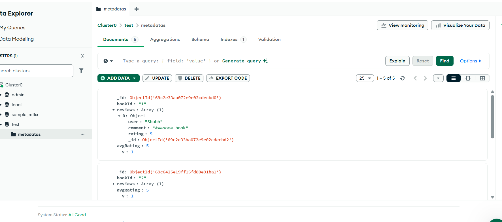
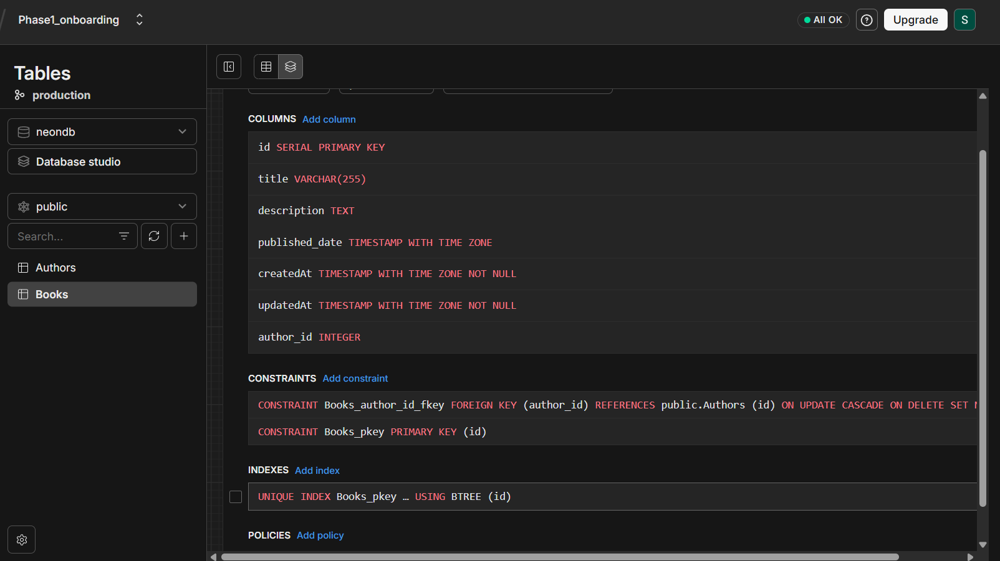

# 📚 GraphQL Library Backend

A GraphQL-based backend built using Node.js, Sequelize, and MongoDB for managing books, authors, and reviews.

---

## 🚀 Tech Stack

- Node.js
- Express.js
- GraphQL
- Sequelize (SQL Database)
- MongoDB (for reviews metadata)

---

## 📌 Features

- 📖 CRUD operations for Books
- ✍️ CRUD operations for Authors
- ⭐ Add reviews with ratings
- 🔍 search support

---

## 📂 Project Structure

backend/
│── models/
│   ├── Book.js
│   ├── Author.js
│   ├── metadata.js
│   ├── index.js
│── graphql/
│   ├── resolvers.js
│   ├── typeDefs.js
│── server.js
│── package.json

---

## 📸 Screenshots

### MONGODB Schema


### NeonDB Schema


## ⚙️ Setup Instructions

### 1️⃣ Clone Repository

```bash
git clone https://github.com/SHUBH9569/onboarding_backend_phase1.git
cd onboarding_backend_phase1